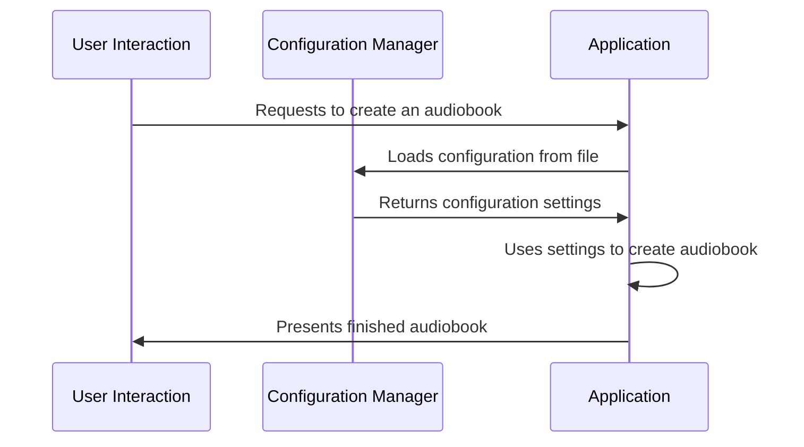

# Chapter 1: Configuration Management

Welcome! This is the first chapter of our journey, and we're going to learn about Configuration Management.

Imagine you want to create an audiobook from a text file. You're excited about hearing the story, but you also want to customize the voice, the output format, and where to save the file. Changing these settings manually every time you create an audiobook would be tedious, right? That's where Configuration Management comes in! It allows us to define and manage these settings in one place, so we can easily change them without altering the core logic of our program.

### What is Configuration Management?

Configuration Management is like having a recipe book for your audiobooks. Each recipe (or configuration) tells the program exactly how to make the audiobook – which voice to use, where to save the result, and so on. This allows you to easily create different types of audiobooks with minimal effort.

### Key Concepts

Let's break down the key concepts involved in Configuration Management:

1.  **Settings:** These are the individual values that control how our program behaves. Examples include the voice to use, the output format, or the save location.

2.  **Configuration:** A collection of related settings that define a specific way of running the program.  Think of it as a complete "recipe."

3.  **File:** The configuration settings are often stored in a file (like a recipe book). This file can be easily shared and edited.

### Using Configuration Management: A Simple Example

Let's say we want to create an audiobook from a text file and save it to a specific folder. Without Configuration Management, we might have to hardcode these values directly into our program. With Configuration Management, we can store these values in a configuration file and load them when needed.

Here's a very simplified example of how we might use it:

1.  **Define Settings:** We need to define our settings, such as the input file path, the voice to use, and the output file path.

2.  **Store Settings:** These settings are then stored in a configuration file.

3.  **Load Settings:**  Our program reads (loads) the configuration file when it starts.

4.  **Use Settings:** The program then uses these settings to create the audiobook.

Let's see how it looks in code:

```python
# Configuration settings (usually loaded from a file)
settings = {
    "input_file": "my_text_file.txt",
    "voice": "female_voice_1",
    "output_file": "my_audiobook.m4b"
}

# Use the settings to create the audiobook
# ... (code to read input file, use voice, and save as output file)
```

This simple snippet demonstrates how easy it is to load and use configuration settings. The program knows exactly what to do thanks to the values defined in the `settings` dictionary.

### Internal Implementation: A Step-by-Step Walkthrough

Let's see how this process unfolds behind the scenes.

**Sequence Diagram:**



The diagram illustrates how the Application relies on the Configuration Manager to get the necessary settings before producing the final audiobook for the User. This separation of concerns makes our program more flexible and easier to maintain.

**Code Dive (Simplified):**

Let's look at a simplified view of how the Configuration Manager might work. The real implementation is more complex, but this illustrates the basic idea.

1.  **Loading Settings:**

```python
# In configuration_manager.py
import json

def load_configuration(file_path):
    """Loads configuration settings from a JSON file."""
    try:
        with open(file_path, 'r') as f:
            return json.load(f)
    except FileNotFoundError:
        print(f"Error: Configuration file not found at {file_path}")
        return {} # or some default configuration
```

This code reads the settings from a JSON file. If the file isn't found, it prints an error message and returns an empty dictionary (or a default configuration).

2.  **Using Settings:**

```python
#In main.py
from configuration_manager import load_configuration

settings = load_configuration("config.json")

print(f"Input file: {settings.get('input_file', 'default_input.txt')}")
```

This code loads the configuration from the `config.json` file and uses the 'input_file' setting. If the setting isn't found, it uses a default value.

The `config.json` file might look like this:

```json
{
    "input_file": "my_text_file.txt",
    "voice": "female_voice_1",
    "output_file": "my_audiobook.m4b"
}
```

### Conclusion

Configuration Management provides a structured way to manage settings in your programs. It improves flexibility, makes programs easier to maintain, and simplifies the process of creating different types of audiobooks.  This is just the beginning of our journey! In the next chapter, we’re going to look at how to use more advanced configuration techniques.

### Where to go from here

*   Explore different configuration file formats like YAML.
*   Learn about environment variables for configuration.
*   Learn about configuration validation techniques.


---

Generated by [AI Codebase Knowledge Builder](https://github.com/The-Pocket/Tutorial-Codebase-Knowledge)