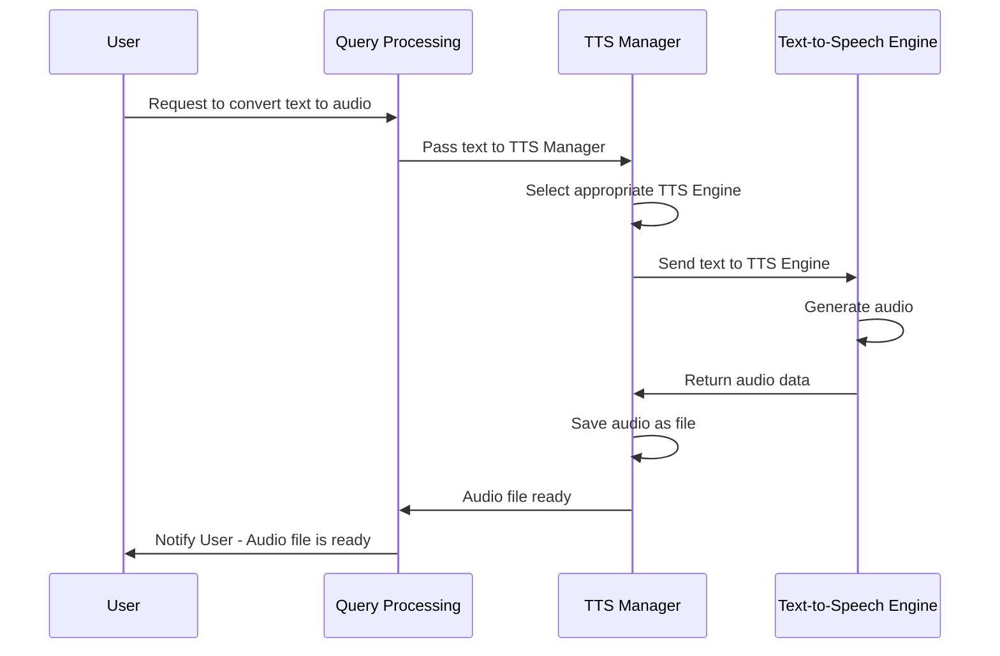

# Chapter 2: TTS Manager

[Chapter 2: Core Abstractions](02_core_abstractions.md) introduced the fundamental building blocks of our system. Now, we need a way to easily turn text into audio. That's where the TTS Manager comes in!

Imagine you're building a chatbot. When the chatbot responds, you want it to *speak* – not just display text. The TTS Manager is responsible for taking text as input and producing an audio file. This chapter explains how the TTS Manager works and how you can use it to give your applications a voice.

## Key Concepts

The TTS Manager abstracts away the complexities of different text-to-speech engines. It handles the details of selecting the correct engine, configuring it, and producing the audio file.  Here's a breakdown of what it does:

1. **Engine Selection:**  Different TTS engines exist (e.g., Google TTS, Microsoft TTS, Amazon Polly). The TTS Manager can choose the best engine based on configuration.
2. **Text Processing:**  Some engines require text to be formatted in a specific way (e.g., SSML).  The TTS Manager can handle this formatting.
3. **Audio Generation:** The TTS Manager calls the selected engine, providing the text, and receives the generated audio data.
4. **File Saving:** The generated audio is saved as an audio file (e.g., WAV, MP3).

## Using the TTS Manager

Let's say we want the chatbot to respond with "Hello, world!". Here's how we're going to use the TTS Manager:

```python
from tts_manager import TTSTextToSpeech

tts = TTSTextToSpeech(text="Hello, world!")
tts.convert_to_audio()
```

This code will:

1. Create a `TTSTextToSpeech` object, giving it the text "Hello, world!".
2. Call the `convert_to_audio()` method, which takes care of all the behind-the-scenes work.

After running this code, you're going to find a file named `sentence_audio_file.wav` (or similar, depending on the configuration) in your working directory – that's our audio!

## Internal Implementation: A Sequence Diagram

Let's illustrate what happens under the hood using a sequence diagram.



The diagram shows that when you ask the system to convert text to audio, the Query Processing component passes the text to the TTS Manager. The TTS Manager then picks a suitable TTS engine, sends the text to the engine, receives the audio, and saves it to a file.  Finally, it notifies the Query Processing component that the audio file is ready.

## Code Walkthrough

Let's break down some of the key components within the `tts_manager.py` file.

First, we define a `TTSTextToSpeech` class:

```python
from torchaudio.save import save
import torch
import re

class TTSTextToSpeech:
    def __init__(self, text):
        self.text = text
        # ... (other initialization)
```

This class takes the text as input during initialization.  The `convert_to_audio` method then handles the heavy lifting.

```python
    def convert_to_audio(self):
      # ... (TTS conversion logic)
```

This `convert_to_audio()` method is the core of the manager. It selects the appropriate TTS engine and converts the input text into an audio file.

The engine selection is driven by configuration settings. It handles things like choosing between Google TTS, Microsoft TTS, and others, and configuring the specific settings for the chosen engine.

## More Detailed Code Breakdown

The `convert_to_audio` method contains many conditional statements to handle the various TTS engines. Here’s a simplified illustration:

```python
    def convert_to_audio(self):
        # Select TTS engine based on configuration
        if self.engine == "google":
            # Call Google TTS API
            audio_data = google_tts(self.text)
        elif self.engine == "microsoft":
            # Call Microsoft TTS API
            audio_data = microsoft_tts(self.text)
        else:
            raise ValueError("Unsupported TTS engine")

        # Save audio data to file
        save(torch.tensor(audio_data), "sentence_audio_file.wav", sample_rate=22050)
```

This snippet illustrates how the code routes the text to a specific TTS service based on a configured `engine` variable.  This variable dictates which API call to make and how to process the resulting audio data.

## Conclusion

The TTS Manager simplifies the process of converting text to audio.  It hides the complexities of different TTS engines and provides a consistent interface for generating audio files.  This allows developers to easily add voice capabilities to their applications.

[Next Chapter: Audio Playback](04_audio_playback.md)

---

Generated by [AI Codebase Knowledge Builder](https://github.com/The-Pocket/Tutorial-Codebase-Knowledge)