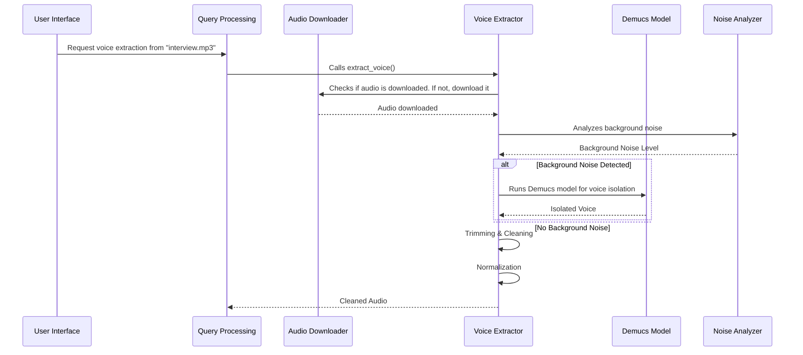

# Chapter 3: Voice Extractor

[Chapter 2: Audio Downloader](02_audio_downloader.md) introduced how to download audio from various sources. Now, let's move on to a more complex task: extracting the voice from that audio, even if it's mixed with other sounds like music or background noise.

Imagine you have a podcast interview recorded in a room. There's music playing softly in the background, and some street noise leaking in. You want to clean up the audio so the speaker's voice is clear and easy to hear. That's what the Voice Extractor abstraction helps you do! It removes unwanted background sounds and isolates the voice.

### Key Concepts

The Voice Extractor is a sequence of steps, each tackling a specific aspect of the audio cleaning process.

1. **Format Validation & Conversion:**  The audio needs to be in a suitable format (like `.wav`) for processing. If it isn’t, we convert it.
2. **Background Detection:** Determines if there's substantial background noise, affecting the processing path.
3. **Voice Isolation (Demucs):**  Uses a powerful AI model called Demucs to separate the voice from other sounds. Think of it like having a magical filter!
4. **Trimming & Cleaning:**  Removes silent portions at the beginning and end of the audio, and eliminates any remaining noise.
5. **Normalization:**  Adjusts the volume of the voice to a consistent level.

### Using the Voice Extractor

Let's walk through a simplified example. Suppose we're starting with an audio file named `interview.mp3`.

```python
from voice_extractor import VoiceExtractor

# Initialize the extractor
extractor = VoiceExtractor(audio_file="interview.mp3")

# Extract the voice
success, message = extractor.extract_voice()

if success:
    print(f"Voice extracted successfully! {message}")
else:
    print(f"Error extracting voice: {message}")
```

This single line of code initiates the entire process! The `VoiceExtractor` handles all the complexities behind the scenes. It will download any missing files, process the audio, and save the cleaned voice as a new file.

### Internal Implementation Walkthrough

Let's break down how the `extract_voice()` method works.

**Sequence Diagram:**



The diagram shows how the user initiates the process, and the `VoiceExtractor` orchestrates the various steps, utilizing the `Audio Downloader` (mentioned in Chapter 2), `Noise Analyzer` and `Demucs Model`.

Now, let's look at some code snippets that illustrate the steps.

**1. Format Validation & Conversion (voice_extractor.py)**

```python
def _convert_to_wav(self):
    """Converts the audio file to WAV format if it's not already."""
    # Simplified implementation - assumes a conversion is needed
    #  ... actual conversion logic would go here ...
    return True, "Audio converted to WAV format.", False
```

This function checks if the audio file is in the correct format and converts it if necessary. Actual implementation would utilize libraries like `pydub` or `ffmpeg` to perform the conversion.

**2. Background Detection (noise_analyzer.py)**

```python
def analyze_noise(self, audio_file):
    """Analyzes the audio file to determine background noise level."""
    # Simplified implementation - dummy value for now
    return False # No background noise
```

This function analyzes the audio and determines if significant background noise is present. This determines whether Demucs needs to run.

**3. Voice Isolation (demucs.py)**

```python
def isolate_voice(self, audio_file):
    """Isolates the voice from the audio using Demucs."""
    # Simplified implementation - assumes isolation is successful
    return True, "Voice isolated using Demucs.", False
```

This function uses the Demucs model to separate the voice from other sounds. The actual implementation would involve loading the model and running the inference.

**4. Trimming & Cleaning (trimmer.py)**

```python
def trim_audio(self, audio_file):
    """Trims silent portions from the audio."""
    # Simplified implementation
    return True, "Audio trimmed.", False
```

This function removes the silent beginning and end of the file, as well as further cleaning of unwanted noise.

**5. Normalization (normalizer.py)**

```python
def normalize_audio(self, audio_file):
    """Normalizes the audio volume."""
    # Simplified implementation
    return True, "Audio normalized.", False
```

This ensures the voice has a consistent volume.

### Conclusion

The Voice Extractor provides a powerful way to extract clean voice from audio, handling complexities like format conversion, noise isolation, and volume normalization. It's a complex abstraction that simplifies the process for the user, allowing them to focus on the final result. This method is particularly helpful for podcasts, interviews, and other recordings where clear voice quality is essential.


---

Generated by [AI Codebase Knowledge Builder](https://github.com/The-Pocket/Tutorial-Codebase-Knowledge)