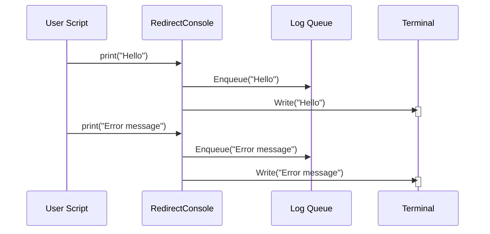

# Chapter 4: RedirectConsole

[Voice Cloning](02_voice_cloning.md) can sometimes produce a lot of output, including warnings and errors. Seeing these messages mixed with our desired output can be distracting and difficult to manage, especially when debugging or sharing results. This chapter introduces `RedirectConsole`, an abstraction designed to capture and redirect the console output, allowing us to separate warnings and errors from our desired results or to log them for later analysis.

Imagine you're using Voice Cloning and want to quickly see only the synthesized speech, without the detailed internal logging. `RedirectConsole` can make this happen.

### Key Concepts: The Problem and the Solution

The core problem we're solving is managing console output:

1.  **Distraction:**  Console output can be noisy and distracting.
2.  **Debugging:** Errors and warnings are vital for debugging but can clutter the main output.
3.  **Logging:** We often need to save console output for later analysis.

`RedirectConsole` solves this by:

1.  **Capturing:**  It intercepts and saves all console output.
2.  **Separating:** It allows us to display only the output we want.
3.  **Logging:** It provides a way to save all the captured output for later review.

### Using `RedirectConsole`: A Simple Example

Let's assume we're running a simple script that generates some text.

```python
import time
from redirect_console import RedirectConsole
from queue import Queue

# Create a queue to hold the redirected output
log_queue = Queue()

# Create a RedirectConsole instance, redirecting output to the queue
console = RedirectConsole(log_queue, sys.__stdout__)

print("This is the main output.")
time.sleep(1) # Simulate some work
print("Another output line.")

# This text would normally go to the console but will be captured by the RedirectConsole
print("This message goes to the redirected console.")
```

This example shows how to create a `RedirectConsole` and direct output to a queue. Now, we can display only the intended output and process the captured logs later.

### Internal Implementation: A Step-by-Step Walkthrough

When we use `RedirectConsole`, here’s what happens:

1.  **Interception:**  All `print` statements are intercepted by the `RedirectConsole` object.
2.  **Queueing:**  The intercepted output is placed in a queue (`log_queue` in our example).
3.  **Display (Optional):**  We can choose to display only a specific portion of the output (e.g., just the lines that don't contain errors).
4.  **Logging:** The entire output (or a filtered version) is saved for later inspection.

Here's a sequence diagram illustrating the process:



### Diving Deeper: Code Implementation

Let's break down the core implementation pieces:

*   **`redirect_console.py`**: This file contains the `RedirectConsole` class.

*   **`__init__` Method**:  This method sets up the redirection, associating the `log_queue` (the queue to capture logs) with the object.

Let's look at the `setup_transformers_logger` function:

```python
    def setup_transformers_logger(self):
        # Configure the `transformers` logger
        transformers_logger = logging.getLogger("transformers")
        transformers_logger.setLevel(logging.WARNING)  # Capture warnings and above

        # Create a handler that writes to this instance
        handler = logging.StreamHandler(self)
        handler.setFormatter(logging.Formatter("%(message)s"))  # Simplified format
        transformers_logger.addHandler(handler)
```

This code snippet configures the `transformers` logger to send warning messages and above to the `RedirectConsole` instance. This ensures that transformer library output is also captured.

The `poll_logs` method allows us to display the captured logs incrementally:

```python
    def poll_logs(self, stop_event):
        logs = ""
        errors = ""
        while not stop_event.is_set() or not log_queue.empty(): #Use a stop event and queue check
            try:
                log = log_queue.get(block=False)
                logs += log + "\n"
            except queue.Empty:
                pass

            yield logs

```

This code continuously checks the `log_queue` for new messages and yields the current log.  This allows for the console output to be displayed incrementally.

### Conclusion

`RedirectConsole` provides a powerful and flexible tool for managing console output, separating desired results from distracting messages, and enabling detailed logging for debugging and analysis.  It's a fundamental building block for more complex applications involving Voice Cloning or other console-based tools. This abstraction makes it easier to manage and understand what's happening under the hood.
[Voice Assistant Integration](05_voice_assistant_integration.md)


---

Generated by [AI Codebase Knowledge Builder](https://github.com/The-Pocket/Tutorial-Codebase-Knowledge)