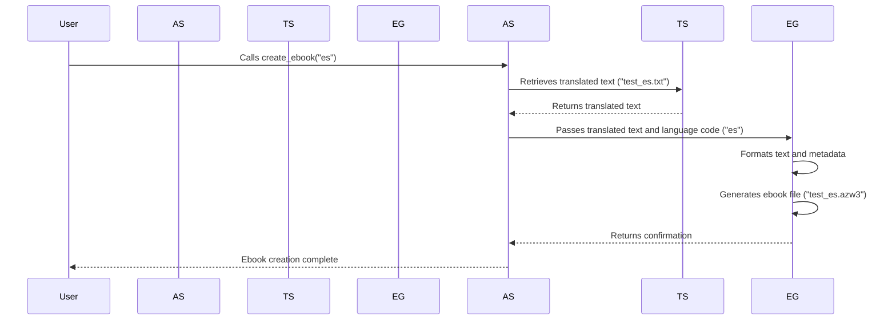

# Chapter 5: Ebook Generation

[From Text-to-Speech](04_text_to_speech.md), we're taking the generated audio and now we want to create ebooks in multiple languages! This allows users to enjoy the content in their preferred language, even if it wasn't originally available. Let's say we've generated a short story in English. We want to create ebooks in Spanish, French, and German for our global audience. This chapter explains how we automate this process.

## The Problem: Multi-Lingual Ebook Creation

Creating ebooks manually for each language is incredibly time-consuming and error-prone. Translating the text, formatting it, and then creating an ebook file for each language is a huge undertaking. Our goal is to automate this process, ensuring consistency and reducing the workload.

## The Abstraction: Automated Ebook Creation

We've created an abstraction that handles the entire ebook creation pipeline for multiple languages. This abstraction takes translated text files as input and generates ebook files (.azw3 format) for each language.

## How to Use the Abstraction: A Simple Example

Let's imagine we have a translated story in Spanish, saved as `test_es.txt`.  Here's how we're calling our automated ebook generation:

```python
# Assume this is part of a larger script
# No actual Python code here, demonstrating the function call

create_ebook(language_code="es")
```

This single line tells our system: "Create an ebook for the Spanish language." The system will automatically:

1.  Find the translated text file (`test_es.txt`).
2.  Generate an ebook file (`test_es.azw3`).
3.  Handle the ebook formatting and metadata.

## Behind the Scenes: A Sequence Diagram

Let’s break down what happens under the hood.  This is a simplified view, assuming the `create_ebook` function has been called.



As you can see, the process involves multiple steps, but the abstraction handles them all behind the scenes.

## Code Implementation Details

The core logic resides in the `ebook-convert` tool, a command-line utility for converting various document formats into ebooks. Our Python script acts as an orchestrator, preparing the input files and calling this tool with the appropriate parameters.

### 1.  `ebook-convert` Configuration

The `ebook-convert` tool needs to be configured with the source file, output format, title, authors, language, and other metadata.

### 2.  `create_ebook` Function: Python Orchestration

The `create_ebook` function (referenced in the example above) uses the `subprocess` module to run the `ebook-convert` tool. It takes the language code as input and dynamically creates the command-line arguments.

Let's look at a simplified view of how the `create_ebook` function might be structured, referencing `ebook_generation.py` (this is a conceptual example and filenames might vary in reality):

```python
# ebook_generation.py
import subprocess
import os

def create_ebook(language_code):
    """
    Creates an ebook for the given language code.
    """
    txt_filename = f"test_{language_code}.txt"
    azw3_filename = f"test_{language_code}.azw3"
    title = f"Ebook {language_code.upper()} Test"
    authors = "Dev Team"
    language = language_code
    input_encoding = "utf-8"

    # Construct the ebook-convert command
    command = [
        "ebook-convert",
        txt_filename,
        azw3_filename,
        "--title", title,
        "--authors", authors,
        "--language", language,
        "--input-encoding", input_encoding
    ]
    # Run the ebook-convert command
    process = subprocess.run(command, capture_output=True, text=True)
    # Print the output of the command
    print(process.stdout)
```

**Explanation:**

*   The `create_ebook` function takes the `language_code` (e.g., "es" for Spanish) as input.
*   It constructs the file names based on the language code.
*   It builds the command-line arguments for `ebook-convert`.
*   It executes `ebook-convert` using `subprocess.run`.
*   It prints the output of the `ebook-convert` process to the console.  This allows us to monitor the conversion progress.

### 3.  Metadata Management

Metadata (title, author, language) is critical for ebook discoverability and organization.  The abstraction ensures that metadata is consistent across all generated ebooks. This is generally handled through command line arguments when calling the `ebook-convert` command.

## Error Handling and Logging

Robust error handling and logging are vital for a production-ready system. The abstraction should gracefully handle situations like missing input files or errors during the conversion process. It should log errors and provide informative messages to the user.

## Conclusion

By automating the ebook creation pipeline, we significantly reduce the manual effort required to create multi-lingual ebooks. This allows us to reach a wider audience and provide a more accessible learning experience.  The abstraction leverages existing tools like `ebook-convert` and orchestrates the process, handling file management, metadata, and error handling.  [Next up: Deployment and Scaling](06_deployment_scaling.md).


---

Generated by [AI Codebase Knowledge Builder](https://github.com/The-Pocket/Tutorial-Codebase-Knowledge)