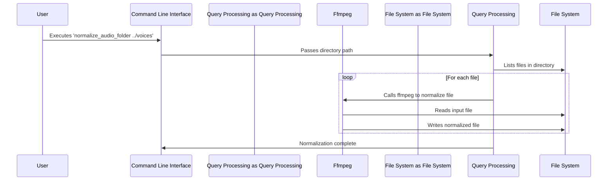

# Chapter 6: Audio Normalization

[Chapter 5: Building the CLI](05_building_the_cli.md) introduced our command-line interface.  Now, we need to make our audio content sound consistent and professional. Imagine you're creating a language learning course: some recordings might be made in quiet rooms, others in bustling environments. Without standardization, the varying audio levels and quality would be jarring and distracting for learners. This is where audio normalization comes in.

Audio normalization is a process that brings audio recordings to a consistent level and improves their overall quality. It addresses problems like varying loudness, inconsistent noise levels, and frequency imbalances. Our abstraction will allow us to make all audio files in a directory sound more similar.

### The Use Case: Consistent Audio Levels in a Language Learning Course

Let’s say we have a directory of audio files for a beginner’s French course. Some recordings are dialogues, others are single speakers. These recordings were made by different people, in different places, using different equipment. The volume ranges wildly from very quiet to quite loud. We want to make these recordings sound consistent so that learners have a better experience.

### Core Concepts of Audio Normalization

Our abstraction uses `ffmpeg`, a powerful open-source tool for processing audio and video files. While `ffmpeg` itself is complex, we're going to focus on a few key concepts.

1.  **Loudness Normalization (Loudnorm):** This ensures that all audio tracks have a similar perceived loudness.  It's like making sure everything is roughly the same volume.
2.  **Dynamic Range Compression (agate):**  This reduces the difference between the loudest and quietest parts of the audio. It’s like gently squeezing the dynamic range to avoid very quiet parts being lost and very loud parts being clipped.
3.  **Frequency Balancing (Equalizer):** This adjusts the levels of different frequencies in the audio. It's like a small tweak to highlight certain tones or reduce unwanted noise.

### Using the Abstraction: Making Audio Levels Consistent

Let's see how we can use our abstraction to make those French course recordings sound better.

We have a script that uses our abstraction: `normalize_audio_folder`. Here's how we use it:

```bash
normalize_audio_folder ../voices
```

This command will normalize all audio files in the `../voices` directory. It uses `ffmpeg` under the hood to apply loudness normalization, dynamic range compression, and frequency balancing.

Here's a breakdown of what happens:

*   `../voices`: This is the directory containing your audio files.
*   `normalize_audio_folder`: This is our script that takes the directory path as an argument and processes each audio file within it.

The script will iterate through each audio file in the specified directory, apply the normalization parameters, and save the processed files, replacing the originals.

### Internal Implementation: How the Abstraction Works

First, let's visualize a sequence diagram that outlines the process when we call `normalize_audio_folder`:



Now, let's look at the code. The core logic resides within the `normalize_audio_folder` script, which utilizes `ffmpeg` commands.

The `normalize_audio_folder` function:

```python
import os
import subprocess

def normalize_audio_folder(directory):
    """
    Normalizes audio files in a given directory using ffmpeg.
    """
    for filename in os.listdir(directory):
        if filename.endswith(".wav") or filename.endswith(".mp3"):
            filepath = os.path.join(directory, filename)
            temp_filepath = os.path.join(directory, "temp_output.wav") # Temporary file
            ffmpeg_cmd = [
                'ffmpeg',
                '-i', filepath,
                '-af', 'agate=threshold=-25dB:ratio=1.4:attack=10:release=250,afftdn=nf=-70,acompressor=threshold=-20dB:ratio=2:attack=80:release=200,equalizer=f=1000:width_type=h:width=1.0',
                '-y', temp_filepath
            ]
            subprocess.run(ffmpeg_cmd)
            os.replace(temp_filepath, filepath) # replace the original
```

This Python script utilizes `ffmpeg` to apply the normalization parameters.

*   The `ffmpeg_cmd` array contains the command to be executed.
*   `-i filepath`: Specifies the input audio file.
*   `-af`: Defines audio filters.
    *   `agate`: Applies dynamic range compression.
    *   `afftdn`: Applies noise reduction.
    *   `acompressor`: Applies loudness normalization.
    *   `equalizer`: Adjusts the frequencies.
*   `-y`: Overwrites the output file if it exists.

### Conclusion

By using this abstraction, we can easily normalize audio files in a directory, ensuring that they have consistent levels and a more professional sound.  This improves the user experience in applications like language learning courses, online lectures, and podcasts. The flexibility of using `ffmpeg` allows for a wide range of customization options to tailor the normalization process to specific needs.

[Next Chapter: Extending the CLI](07_extending_the_cli.md)


---

Generated by [AI Codebase Knowledge Builder](https://github.com/The-Pocket/Tutorial-Codebase-Knowledge)