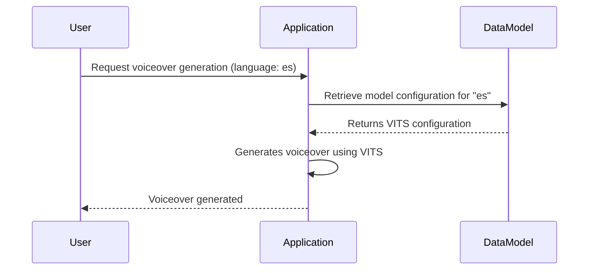

# Chapter 8: Data Models

[Previous Chapter: Configuration Management](07_configuration_management.md)

Imagine you want to generate a voiceover for a children's story. This story is in Spanish, and you want to use a specific voice model that’s been trained on Spanish text.  You also want to ensure the output audio has a consistent sample rate.  This is where data models come in. They help us organize and manage information about different voice models and their configurations.  Without them, it would be difficult to select the right model, manage its parameters, and ensure compatibility. This chapter introduces these data models, explaining how they structure the information needed to work with different TTS models.

## High-Level Motivation: Organizing Our Voice Models

Currently, our system holds information about several different models (VITS, Fairseq, XTTS, etc.) and their configurations, like the language they support, where to download them, and their sample rates. This information is scattered, which makes it hard to:

1.  **Select the right model:** We want to easily find a model that supports Spanish.
2.  **Manage configurations:** Sample rates and other parameters need to be consistent across models.
3.  **Extend the system:** Adding a new model requires updating many places.

Data models solve this problem by providing a central place to define all this information in a structured way.

## Key Concepts: Breaking Down the Data

Let's dive into the core components of our data models.

1.  **Model Types:** This defines the *type* of TTS model we’re using (e.g., VITS, XTTS, Fairseq).  Each type has its own specific characteristics.

2.  **Model Configuration:**  This specifies how the model should be used. It includes things like the download location, sample rate, and any language support.

3.  **Language Support:**  Indicates which languages the model is designed to work with.

Let's see how this looks in code.

```python
# model_data.py
models = {
    "VITS": {
        "internal": {
            "lang": "multi",
            "repo": "tts_models/[lang]/[xxx]",
            "sub": {
                "css10/vits": ['es','hu','fi','fr','nl','ru','el'],
                "custom/vits": ['ca'],
                "custom/vits-female": ['bn', 'fa'],
                "cv/vits":['bg','cs','da','et','ga','hr','lt','lv','mt','pt','ro','sk','sl','sv'],
                "mai/vits": ['uk'],
                "mai_female/vits": ['pl'],
                "openbible/vits": ['ewe','hau','lin','tw_akuapem','tw_asante','yor'],
                "thorsten/tacotron2-DDC": ['de'],
                "vctk/vits": ['en']
            },
            "voice": None,
            "files": None, # Will be loaded from configuration
            "samplerate": 22050
        }
    },
    "XTTS": {
        "internal": {
            "lang": "multi",
            "repo": "https://huggingface.co/emilioxr/whisper-timeloq",
            "sub": {
                "xtts_v1": ['en', 'es', 'fr', 'de', 'it', 'pt', 'ja', 'zh']
            },
            "voice": None,
            "files": None, # Will be loaded from configuration
            "samplerate": 24000
        }
    }
}
```

This code defines two models, "VITS" and "XTTS."  Each model has an "internal" section, which contains information about its language support ("lang"), where to download the model ("repo"), and its default sample rate.  Notice the use of lists in the `sub` key. These represent available voice configurations for each model.

## Using the Data Models: Generating Our Spanish Voiceover

Let's say we want to use the VITS model to generate a Spanish voiceover.  We can use the data models to find the right configuration.

```python
# example.py
from model_data import models

def generate_voiceover(language):
  """Generates a voiceover in the specified language using a suitable model."""

  for model_name, model_data in models.items():
    if model_data["internal"]["lang"] == "multi":
      for config_name, supported_languages in model_data["internal"]["sub"].items():
        if language in supported_languages:
          print(f"Using {model_name} ({config_name}) for {language}")
          # Actual generation code would go here
          return

  print(f"No suitable model found for {language}")

generate_voiceover("es") # Output: Using VITS (css10/vits) for es
```

This code iterates through the available models and checks if the specified language ("es" for Spanish) is supported. If it finds a suitable model, it prints a message indicating which model is being used. The actual voiceover generation code would go in place of the `return` statement.

## Sequence Diagram

Here's a sequence diagram illustrating how these data models are used:



## Future Considerations: Expanding the System

As we add more models to our system, we need to ensure that our data models can accommodate them.  Here are some future considerations:

*   **Model Metadata:**  Adding more metadata, such as the model's training data or its intended use case.
*   **Version Control:**  Tracking different versions of the data models.
*   **Dynamic Loading:**  Loading the data models from an external file or database.

By using structured data models, we can create a more organized and extensible TTS system.  This allows us to easily select the right model, manage its configurations, and extend the system as needed.


---

Generated by [AI Codebase Knowledge Builder](https://github.com/The-Pocket/Tutorial-Codebase-Knowledge)