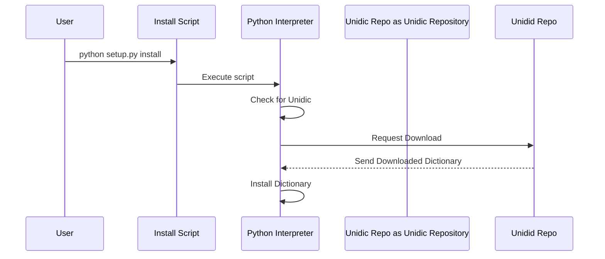

# Chapter 9: Setup Script

[Chapter 8: Model Definition](08_model_definition.md) showed us how to define our data models. Now, we need a way to automatically set up our environment and download necessary resources. This is where the setup script comes in. It ensures our application has everything it needs to run, like dictionaries and other data files.

Imagine you're building a Lego castle. You wouldn't just start building; you'd first want to make sure you have all the Lego bricks you need. Our setup script is like that brick inventory checker and downloader.

### The Problem: Dependencies and Automation

When we develop software, we often rely on other pieces of software – we call these dependencies.  These dependencies can be anything from libraries that help us process text to dictionaries for generating realistic speech.  Manually downloading and setting up these dependencies can be tedious and error-prone.  We want a reliable, automated way to ensure everything is in place before we start building our audiobook.

### The Solution: The `setup.py` Script

We're using a file called `setup.py` to automate this process. `setup.py` is a standard Python file that tells Python how to build and install a package. We’re leveraging this standard convention to also handle our dependency downloads.

### How to Use the Setup Script

To run the setup script, simply open your terminal or command prompt, navigate to the root directory of your project (where `setup.py` is located), and type:

```bash
python setup.py install
```

This command will execute the instructions within `setup.py`, download any missing dependencies (like the Unidic dictionary), and install them.  After running this command, you can proceed with building your audiobook.

### Example: Downloading the Unidic Dictionary

One crucial dependency is the Unidic dictionary, which provides Korean words and their information.  The setup script automatically handles this.  When you run `python setup.py install`, the script will check if Unidic is already downloaded. If not, it will download it from the official repository.

### The Internal Implementation

Let's break down what’s happening under the hood.  First, we're using the `setup.py` file to manage our installation. The `PostInstallCommand` class within this file defines the action to be performed *after* the installation is completed. This allows us to execute commands that require the environment to be set up.

The core of the setup process is downloading the Unidic dictionary. Let's illustrate this with a simple sequence diagram:



Here's a simplified breakdown of how the `PostInstallCommand` works within `setup.py`:

1. **Check for Unidic:** The script first checks if the Unidic dictionary is already present in the designated location.
2. **Download Unidic:** If not present, the script initiates a download from the official Unidic repository.
3. **Install Dictionary:** Once the download is complete, the dictionary is installed in the appropriate directory.

Now, let's examine the relevant code within `setup.py`:

```python
import subprocess
import sys

class PostInstallCommand(install):
    def run(self):
        install.run(self)
        try:
            subprocess.run([sys.executable, 'python -m', 'unidic', 'download'], check=True)
        except Exception:
            print("unidic download failed during installation, but it will be re-attempted a diffrent way when the app itself runs.")
```

*   **`import subprocess` and `import sys`:** We import necessary modules for executing shell commands and accessing the Python interpreter.
*   **`class PostInstallCommand(install):`**: We define a class that extends the `install` command from the `setuptools` library.  This allows us to customize the installation process.
*   **`def run(self):`**: This method is executed during the installation process.
*   **`subprocess.run([sys.executable, 'python -m', 'unidic', 'download'], check=True)`**: This line executes the `unidic download` command using the current Python interpreter.  `check=True` ensures that the script raises an error if the command fails.

This snippet uses the `unidic` command-line tool (a dependency of our project) to automatically download the dictionary files, placing them in the appropriate location.  The `try...except` block handles potential errors during the download process and prints a helpful message if something goes wrong.

### Conclusion

The setup script automates the crucial step of downloading dependencies, guaranteeing a smooth and consistent development environment.  By using `setup.py` and leveraging the `unidic` command-line tool, we ensure that our application has everything it needs to create stunning audiobooks.

[Next Chapter: Data Processing](10_data_processing.md)


---

Generated by [AI Codebase Knowledge Builder](https://github.com/The-Pocket/Tutorial-Codebase-Knowledge)