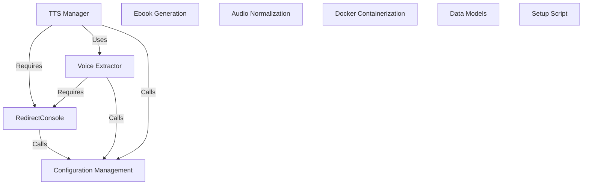

# Tutorial: ebook2audiobook_dd

This project focuses on automating audiobook creation and voice normalization tasks. It involves translating text into audio and improving the quality of existing voice recordings.  The main components include *text-to-audio translation* and *audio normalization* processes, ensuring a polished final product. The audio normalization steps leverage **FFmpeg** for signal processing and enhancement.

**Source Repository:** [https://github.com/ddrews-de/ebook2audiobook_dd](https://github.com/ddrews-de/ebook2audiobook_dd)

## Chapters

1. [Configuration Management](01_configuration_management.md)
2. [TTS Manager](02_tts_manager.md)
3. [Voice Extractor](03_voice_extractor.md)
4. [RedirectConsole](04_redirectconsole.md)
5. [Ebook Generation](05_ebook_generation.md)
6. [Audio Normalization](06_audio_normalization.md)
7. [Docker Containerization](07_docker_containerization.md)
8. [Data Models](08_data_models.md)
9. [Setup Script](09_setup_script.md)

---

Generated by [AI Codebase Knowledge Builder](https://github.com/The-Pocket/Tutorial-Codebase-Knowledge)